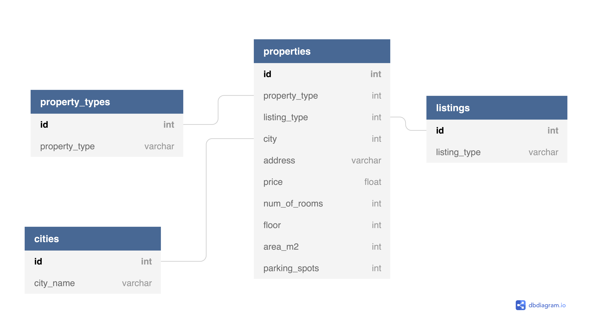

# Web scraping OnMap
https://github.com/lnros/real-estate-web-scraping

This web scraper get the data from properties for sale and rent from  the Israeli [OnMap](https://www.onmap.co.il/en/)  website.

The website has four main data sources: buy, rent, new homes and commercial data.


#### Buy:
Properties for sale

#### Rent:
Properties for rent

#### Commercial:
Commercial properties for rent

#### New homes:
Properties that are on planning or construction phase


## The scraper

The scraper is built using a mixture of [*Selenium*][selenium-site] and [*BeautifulSoup*][bs4-site].
*Selenium* is in charge of scrolling each webpage to the bottom so that *BeautifulSoup* can read the entire HTML.

### Usage

Run `web_scraper.py` from the Command Line.

```
usage: web_scraper.py [-h] [--limit n] [--print] [--save] [--database] [--verbose] {buy,rent,commercial,new_homes,all}

Scraping OnMap website | Checkout https://www.onmap.co.il/en/

positional arguments:
  {buy,rent,commercial,new_homes,all}
                        choose which type of properties you would like to scrape

optional arguments:
  -h, --help            show this help message and exit
  --limit n, -l n       limit to n number of scrolls per page
  --print, -p           print the results to the screen
  --save, -s            save the scraped information into a csv file in the same directory
  --database, -d        inserts new information found into the on_map database
  --verbose, -v         prints messages during the scraper execution

```


## The database

The intended ERD for the final of this project is:


- In `property_types`, we have whether the property is an apartment, penthouse, cottage, and so on.

- In `cities`, we have all the city names of the properties.

- In `listings`, we have the listing types offered on the website: `buy, rent, commercial, new homes`.

- In `properties`, each record is a different property in the website, providing address, price, number of rooms, in which floor it is located, the area and the number of parking spots available.

### Known issues:

- **Foreign Keys:** For now, to make our visualization of the database clearer, in `properties` the link to foreign keys was done to their names rather than their id.

- **Temp table:** Also, for the sake of visualization, for now we created a new table `new_homes` to see that everything is working as it should. 
Later on, `new_homes` will be merged into `properties`.
Fow now, `new_homes` has fewer columns since these properties provide less information and have a new column called `status`.

- **Unique property id:** At this point, whenever we want to add information into the database, we are actually creating the database from scratch every time.
Since each property doesn't have a unique identifier, the next phase is for us to generate a unique
identifier per property so that will make us able to search an earlier record and see if it matches the new one we are checking whether to insert.

#### Authors
@lnros - Leonardo Rosenberg <br>
@Shahar9772 - Shahar Shoshany


[selenium-site]: https://selenium-python.readthedocs.io/

[bs4-site]: https://readthedocs.org/projects/beautiful-soup-4/