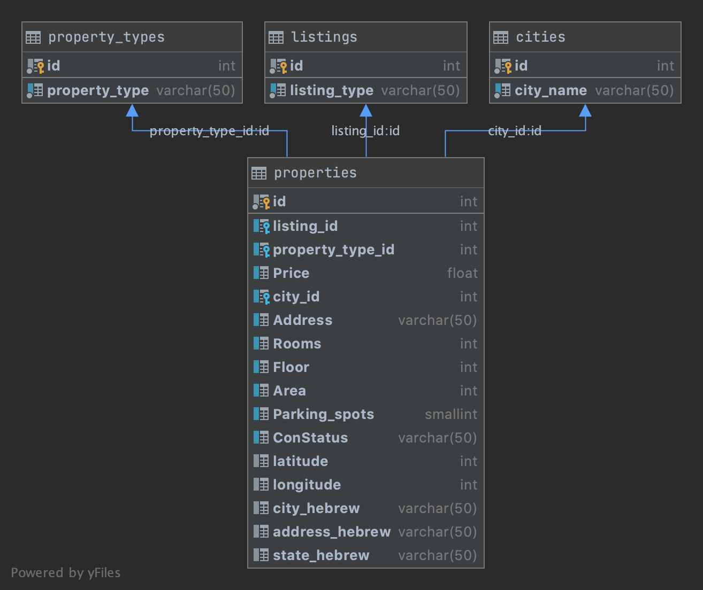

# Web scraping OnMap
https://github.com/lnros/real-estate-web-scraping

This web scraper get the data from properties for sale and rent from  the Israeli [OnMap](https://www.onmap.co.il/en/)  website.

The website has four main data sources: buy, rent, new homes and commercial data.

| **Listing type** | **Description**|
| :-------------|:---------------|
| Buy | Properties for sale |
| Rent | Properties for rent |
| Commercial | Commercial properties for rent|
| New homes| Properties that are on planning or construction phase|


## The scraper

The scraper is built using a mixture of [*Selenium*][selenium-site] and [*BeautifulSoup*][bs4-site].
*Selenium* is in charge of scrolling each webpage to the bottom so that *BeautifulSoup* can read the entire HTML.

### Usage

Run `web_scraper.py` from the Command Line.

```
usage: web_scraper.py [-h] [--limit n] [--print] [--save] [--database]
                      [--fetch] [--verbose]
                      {buy,rent,commercial,new_homes,all}

Scraping OnMap website | Checkout https://www.onmap.co.il/en/

positional arguments:
  {buy,rent,commercial,new_homes,all}
                        choose which type of properties you would like to
                        scrape

optional arguments:
  -h, --help            show this help message and exit
  --limit n, -l n       limit to n number of scrolls per page
  --print, -p           print the results to the screen
  --save, -s            save the scraped information into a csv file in the
                        same directory
  --database, -d        inserts new information found into the on_map database
  --fetch, -f           fetches more information for each property using
                        Nominatim API
  --verbose, -v         prints messages during the scraper execution
```


## The database

The current ERD for the of this project is:


- In `property_types`, we have whether the property is an apartment, penthouse, cottage, and so on.

- In `cities`, we have all the city names of the properties.

- In `listings`, we have the listing types offered on the website: `buy, rent, commercial, new homes`.

- In `properties`, each record is a different property in the website, providing address, price, number of rooms, in which floor it is located, the area and the number of parking spots available.
If the property is under constructions, the `ConStatus` tells what the construction status is. Latitude, longitude, and details in Hebrew are obtaibed using GeoPy with Nominatim service and might not be available for all properties due to request limitations since Nominatim is a free and limited API.


#### Authors
@lnros - Leonardo Rosenberg <br>
@Shahar9772 - Shahar Shoshany


[selenium-site]: https://selenium-python.readthedocs.io/

[bs4-site]: https://readthedocs.org/projects/beautiful-soup-4/